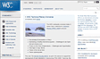

# mission-04
grid로 새소식 콘텐츠 배치하기

## 1. 결과


## 2. 마크업 구조 분석
```html
  <section class="news"> //그리드 컨테이너
    <h2 class="news-title">새소식</h2>
    <figure class="news-image">
      
      <figcaption>W3C 리뉴얼</figcaption>
    </figure>
    <h3>W3C 사이트가 리뉴얼 되었습니다.</h3>
    <p class="date">
      <time datetime="2022-07-18">2022.07.18</time>
    </p>
    <p class="text">
        디자인 및 다양한 view 환경을 고려하여 구성되어 있으며, 기존보다 최신 정보 및 개발자를 위한 기술 가이드도 찾기 쉽도록 구성되어 있습니다.
    </p>
    <p class="more">
      <a href="#"><i class="xi-plus"></i>더보기</a>
    </p>
  </section>
```

- time태그는 주로 일반 텍스트로 보이는 날짜와 시간 정보를 의미있는 날짜, 시간 정보임을 HTML을 알려주기 위해서 사용된다.
우리는 2022.07.18 이라는 콘텐츠가 날짜인것을 알지만 컴퓨터는 날짜로 인식을 못하기때문에 기계가 읽을수 있도록 time태그를 썼다.
- W3C 사이트가 리뉴얼 되었습니다 를 제목태그를 준 이유는 더보기로 다른 링크로 넘어갔을때 이부분이 그냥 문장이 아니라 제목일 것이라고 생각했기 때문에 h3태그를 썼다.
- 더보기를 맨 마지막에 마크업 한 이유는 제목이나오고 바로 더보기가 나오면 어떤 내용을 더보기 해야하는지 알수가 없기때문에 전체적인 내용 파악 후 더보기를 할 수 있도록 맨 마지막에 넣었다.

## 3. 어려웠던 점
- 그리드 영역을 몇개로 나눠야하는지도 명확하게 보이지않아서 고민을 많이했고 나눈 영역에 각각의 콘텐츠들을 배치 시키는 것도 어렵게 느껴졌다. grid 영상을 보고 학습하고, 개구리 게임도 했지만 확실히 grid로 실제 ui를 구현하는건 생각보다 복잡한것 같다. 그리드는 많이 써봐야 제대로 알것 같은 생각이 든다! 
